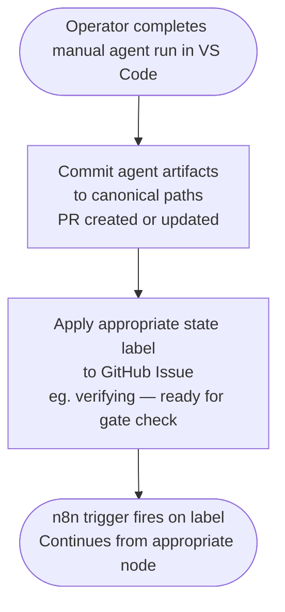
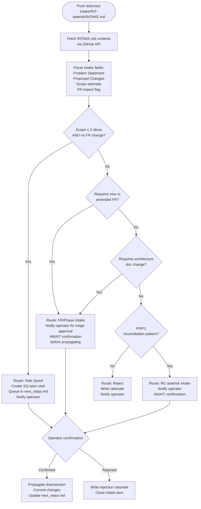
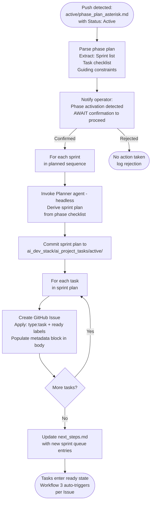

# n8n Process Flows

**Status:** Draft
**Version:** 0.1
**Date:** 2026-04-15

Detailed step-by-step process flows for all three n8n workflows and the hybrid handoff protocol.
Architecture overview: `docs/n8n-orchestration.md`

---

## 1. Workflow 3 — Task Execution Engine

### 1.1 Standard Execution Flow

```mermaid
flowchart TD
    T1([GitHub Issue labeled: ready]) --> T2[Fetch Issue via GitHub API\nGet: number, title, body, labels]
    T2 --> T3[Parse Task Metadata\nExtract: taskId, flags, maxIterations]
    T3 --> T4{human-in-progress\nlabel present?}
    T4 -->|Yes| T99([HALT — mutex active\ndo not proceed])
    T4 -->|No| T5{architecture_contract_change\nflag set?}
    T5 -->|Yes| T98[Transition → needs-human\nWrite handoff note\nPost comment: arch contract flag\nrequires human review]
    T5 -->|No| T6[Initialize execution state\niteration = 0]
    T6 --> T7[Transition → implementing\nRemove: ready]
    T7 --> T8[sprint-controller\nPhase 1: notify operator\nPhase 4+: headless LLM]
    T8 --> T9[implementer\nPhase 1: notify operator\nPhase 5+: headless LLM]
    T9 --> T10{fast-track label?}
    T10 -->|Yes| T11[Checkpoint Commit Node\ncommit at each 300-400 line boundary\nor logical boundary]
    T10 -->|No| T12
    T11 --> T12[Transition → verifying\nRemove: implementing]
    T12 --> T13[Run Verifier Gates\n1. flake8\n2. mypy\n3. pytest\n4. validate_test_results.py]
    T13 --> T14[Parse gate output\nWrite test_results.json\nto canonical path]
    T14 --> T15{All gates PASS?}
    T15 -->|Yes| T16[documenter\nPhase 1-2: notify operator\nPhase 3+: headless LLM]
    T16 --> T17[Transition → done\nClose Issue\nMerge PR]
    T15 -->|No| T18{iteration < maxIterations?}
    T18 -->|Yes| T19[Increment iteration\nTransition → fix-required]
    T19 --> T20[fixer\nPhase 1-2: notify operator\nPhase 3+: headless LLM]
    T20 --> T12
    T18 -->|No| T21{recoverable flag\nin verifier output?}
    T21 -->|Yes| T22[Transition → needs-human\nWrite handoff_{taskId}.md\nPost failure summary comment]
    T21 -->|No| T23[Transition → failed\nPost failure summary comment]
```

---

### 1.2 Node Specifications

#### Trigger Node
- **Type:** GitHub Trigger
- **Resource:** Issue
- **Events:** labeled
- **Filter:** label name == `ready` AND `human-in-progress` label is absent
- **Phase:** 1

#### Fetch Issue Node
- **Type:** GitHub — Get Issue
- **Output:** `issue_number`, `title`, `body`, `labels[]`
- **Phase:** 1

#### Parse Task Metadata Node
- **Type:** Function
- **Extracts from Issue body YAML block:**
  - `task_id`
  - `max_iterations` (default: 5)
  - `fast_track` (boolean)
  - `architecture_contract_change` (boolean)
  - `fr_ids_in_scope` (string array)
- **Phase:** 1

#### Initialize State Node
- **Type:** Function
- **Sets:** `{ taskId, iteration: 0, status: "implementing" }`
- **Phase:** 1

#### Transition Label Node (reusable pattern)
- **Type:** GitHub — Edit Issue (applied at each state transition)
- **Operation:** Remove outgoing state label, apply incoming state label
- **Phase:** 1

#### Verifier Node
- **Type:** Execute Command
- **Phase 1:** Replace with notification; operator runs gates manually in VS Code
- **Phase 2+:** Shell execution
- **Gate commands (from `AI_RUNTIME_GATES.md`):**
  ```bash
  python -m flake8 --max-line-length=120 <changed files>
  python -m mypy <changed files> --ignore-missing-imports
  python -m pytest <relevant test files> -x
  python ai_dev_stack/scripts/validate_test_results.py
  ```
- **Output:** Writes `ai_dev_stack/ai_project_tasks/active/test_results.json`
- **Timeout:** 5 minutes

#### Fixer Node
- **Type:** Execute Command (Phase 3+) or Notification (Phase 1–2)
- **Command:** `node run-agent.js fixer {{$json.taskId}}`
- **Reads:** `test_results.json`, `ai_dev_stack/ai_project_tasks/active/brief_{taskId}.md`
- **Writes:** code changes committed to PR branch
- **Timeout:** 10 minutes

#### Documenter Node
- **Type:** Execute Command (Phase 3+) or Notification (Phase 1–2)
- **Command:** `node run-agent.js documenter {{$json.taskId}}`
- **Reads:** implementation artifacts, sprint plan
- **Writes:** documentation changes committed to PR branch
- **Timeout:** 5 minutes

#### Needs-Human Node
- **Type:** Function + GitHub (multi-step)
- **Steps:**
  1. Write `ai_dev_stack/ai_state/handoff_{taskId}.md` via GitHub commit API
  2. Apply `needs-human` label; remove current state label
  3. Post GitHub Issue comment with handoff summary (mirrors handoff file content)
- **Phase:** 1

---

## 2. Human Handoff Flows

### 2.1 n8n → VS Code (Pause and Resume)

```mermaid
flowchart TD
    H1([n8n reaches needs-human state]) --> H2[Write ai_dev_stack/ai_state/handoff_{taskId}.md\ncommitted to repo via GitHub API]
    H2 --> H3[Apply label: needs-human\nRemove: current state label\nPost GitHub Issue comment with context]
    H3 --> H4([HALT — n8n workflow\nbranch ends here])

    H5([Operator: receives notification]) --> H6[Open VS Code\nRead handoff_{taskId}.md and\ntest_results.json]
    H6 --> H7[Apply label: human-in-progress\nn8n trigger filter excludes this Issue]
    H7 --> H8[Run appropriate agent in VS Code chat\neg. fixer-v5 or implementer-v5]
    H8 --> H9[Commit agent output\nto canonical artifact paths]
    H9 --> H10[Remove labels: human-in-progress + needs-human\nApply next state label\neg. verifying]
    H10 --> H11([n8n trigger fires on label change\nResumes from Verifier node])
```

### 2.2 VS Code → n8n (Yield to Automation)



### 2.3 Handoff Decision Guide

| Situation | Action |
|-----------|--------|
| Fixer failed max iterations, code issue is clear | Apply `human-in-progress`, run fixer-v5 in VS Code, commit, apply `verifying` |
| Gate failure requires architectural decision | Apply `human-in-progress`, resolve in VS Code, commit, apply `verifying` |
| Operator wants to hand sprint-controller + implementer to VS Code | Run in VS Code, commit, apply `verifying` — n8n picks up at verifier |
| Operator wants n8n to run gates after a manual implementer session | Commit code, apply `verifying` — n8n runs verifier automatically (Phase 2+) |

---

## 3. Workflow 1 — Intake Router



**Phase target:** Phase 4. All routes are advisory; operator confirmation is required before any
downstream propagation occurs.

---

## 4. Workflow 2 — Phase → Sprint Activator



**Phase target:** Phase 4. Operator confirmation gate before Issue creation is mandatory.

---

## 5. Error Handling

### 5.1 Global Error Trigger

All three workflows attach to n8n's Global Error Trigger node:

1. Log error details to n8n execution log with `taskId` and `workflowId`
2. Post a comment on the associated GitHub Issue (if `taskId` is available in error context)
3. Apply `failed` label if Issue exists and current state is not already `done` or `failed`
4. Alert operator via notification channel

### 5.2 Node Timeout Policy

| Node              | Timeout   | On Timeout Behavior              |
|-------------------|-----------|----------------------------------|
| Verifier (shell)  | 5 minutes | Treat as FAIL, `recoverable: true` |
| Fixer (LLM)       | 10 minutes | Treat as FAIL, `recoverable: true` |
| Implementer (LLM) | 20 minutes | Treat as FAIL, `recoverable: true` |
| Documenter (LLM)  | 5 minutes  | Treat as FAIL, `recoverable: true` |
| GitHub API nodes  | 30 seconds | Retry once; then Global Error Trigger |

### 5.3 Stuck Issue Recovery

If an Issue is stuck in a non-terminal state with no active n8n execution (e.g., after a crash):

1. Operator manually reads `ai_dev_stack/ai_state/task_{task-id}_status.json`
2. Applies `human-in-progress` label
3. Corrects state as needed
4. Removes `human-in-progress` and applies the correct state label to re-enter the workflow
